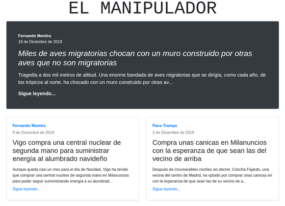

# Docker Training

Este proyecto consiste en un tutorial paso a paso de como dockerizar una aplicación web. Cada commit consiste en un cambio orientado a dockerizar la aplicación. Partimos de un estado inicial con una aplicación hecha en Django que se instala sobre la máquina directamente y terminamos con una aplicación completamente dockerizada.

## Estado inicial

Para poner en marcha la aplicación tenemos que realizar los siguientes pasos:

1. Instalar python 3.6: `sudo apt-get install python3.6`

2. Instalar pip: `sudo apt-get install python3-pip`

3. Instalar django: `python3.6 -m pip install Django==3.0`

4. Arrancar la aplicación: `python3.6 elmanipulador/manage.py runserver 0.0.0.0:8000`

Ahora ya podemos acceder a la web en <http://localhost:8000/> y al backoffice en <http://localhost:8000/admin/> con el usuario 'admin' y la contraseña 'admin'.

## Instalación de Docker

Antes de empezar a dockerizar la aplicación debemos [instalar](https://docs.docker.com/install/linux/docker-ce/ubuntu/) y [configurar](https://docs.docker.com/install/linux/linux-postinstall/) Docker. Además, necesitaremos tener un usuario en [DockerHub](https://hub.docker.com/) para poder guardar la imagen creada en un repositorio. Finalmente, debemos hacer login en nuestro terminal: `docker login`.

## Pasos

### Paso 1

Creamos el Dockerfile:

```Docker
FROM python:3.6

RUN pip install Django==3.0

COPY . /code
```

En primer lugar indicamos que queremos usar la imagen de [python](https://hub.docker.com/layers/python/library/python/3.6/images/sha256-1a5455c32fa8db385e7266850ca9604c0d8ce3416448e35b3e1e8fb24676d47b), concretamente la versión 3.6. En segundo lugar instalamos la versión de Django que necesitamos, en este caso, la versión 3.0. Finalmente, copiamos el contenido del proyecto dentro del directorio /code de la imagen.

Ahora que tenemos hecha la definición lo que nos falta es generar la imagen:

1. Nos situamos en el directorio de la aplicación: `cd elmanipulador`

2. Construimos la imagen y le damos un nombre dentro del namespace de nuestro usuario: `docker build -t <namespace>/elmanipulador .`

Una vez generada la imagen ya podemos arrancar un contenedor nuevo:
`docker run --rm -d <namespace>/elmanipulador python /code/manage.py runserver 0.0.0.0:8000`

Para verificar que la aplicación ha arrancado correctamente podemos entrar en el contenedor y hacer una petición a la aplicación:

1. Consultamos cual es el id del contenedor creado: `docker ps`

2. Abrimos una shell del contenedor: `docker exec -it <container_id> bash`

3. Hacemos una petición a la aplicación: `curl localhost:8000`

Si la respuesta es una página HTML con información de artículos quiere decir que funciona bien.

### Paso 2

Hemos visto que dentro del contenedor podemos acceder a la aplicación web. Sin embargo, no podemos acceder desde fuera. Si accedemos con el navegador a <http://localhost:8000/> veremos que nos dice 'This site can’t be reached'.

El motivo de que no funcione es que no estamos exponiendo el puerto del contenedor, y por lo tanto, nuestra máquina no tiene visibilidad de la aplicación. Para que funcione tenemos que levantar el contenedor de nuevo indicando que queremos que el puerto 8000 del contenedor sea algún puerto de nuestra máquina. En nuestro caso vamos a hacer que el puerto 8000 del contenedor se corresponda con el 9000 de nuestra máquina:

1. Consultamos el id del contenedor: `docker ps`

2. Paramos y eliminamos el contenedor: `docker rm -f <container_id>`

3. Arrancamos el contenedor enlazando los puertos: `docker run --rm -d -p 9000:8000 <namespace>/elmanipulador python /code/manage.py runserver 0.0.0.0:8000`

Ahora ya podemos acceder a <http://localhost:9000/>:


